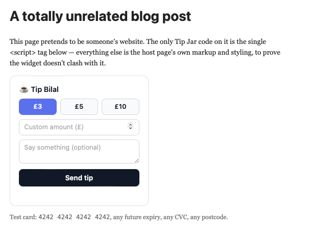

# ☕ Tip Jar

An embeddable "buy me a coffee" widget powered by **Stripe Checkout**. Drop a
single `<script>` tag onto any website and let visitors send a one-off tip — no
framework required on the host page.

**Live:** https://tipjar.bilalhasson.com · https://tip-jar-production.up.railway.app

```html
<script src="https://tipjar.bilalhasson.com/widget.js"
        data-creator="Bilal"
        data-currency="gbp"
        data-amounts="3,5,10"></script>
```

That one tag is the entire integration.



## Features

- **One-tag embed** — framework-agnostic vanilla JS; no build step, no dependencies on the host page.
- **Three placements** — `inline`, a `floating` corner button, or a `modal` dialog.
- **Shadow DOM isolation** — renders in a shadow root, so the host page's CSS can't leak in (or out).
- **Preset + custom amounts** — configurable tip buttons plus a free-entry field (decimals supported).
- **Themeable** — automatic light/dark, plus configurable accent colour, avatar, and title.
- **JavaScript API** — `window.TipJar.render()/open()/close()`, multiple instances per page.
- **Hosted Stripe Checkout** — the visitor is redirected to Stripe's own payment page.
- **Webhook-confirmed** — tips are recorded only after a signature-verified Stripe event.
- **Optional message** — visitors can leave a private note, stored with the tip.

## How it works

```
Host page (widget.js)                Backend (FastAPI)                 Stripe
─────────────────────                ─────────────────                 ──────
click amount ──POST /create-checkout-session──▶ create Checkout Session ──▶
        ◀─────────── { url } ───────────────────
redirect browser ──────────────────────────────────────────▶ hosted payment page
                                                                    │ pays
        ◀──────────────── redirect to /success ─────────────────────┘
                                     POST /stripe-webhook ◀── checkout.session.completed
                                     verify signature → record Tip
```

Two deliberate design choices, both about trust and safety:

- **Raw card data never touches this backend.** We only ever create a Checkout
  Session server-side and redirect to Stripe's hosted page, keeping PCI scope
  minimal.
- **The webhook is the source of truth, not the redirect.** A browser redirect
  to `/success` can be faked, dropped, or replayed, so it's treated as cosmetic.
  A tip is recorded **only** when Stripe delivers a `checkout.session.completed`
  event whose signature verifies against our signing secret. Deliveries are
  idempotent (keyed on the Checkout Session id), so Stripe's retries can't create
  duplicates.

Everything runs in **Stripe test mode** — no real money.

## Configuration (widget `data-` attributes)

| Attribute | Default | Description |
|---|---|---|
| `src` | — | URL to `widget.js`; its origin is the API base by default. |
| `data-creator` | — | Name shown on the widget and attached to the tip. |
| `data-currency` | `gbp` | ISO currency code (`gbp`, `usd`, `eur`, …); drives `Intl` formatting. |
| `data-amounts` | `3,5,10` | Comma-separated preset amounts (decimals allowed). |
| `data-placement` | `inline` | `inline` · `floating` · `modal`. |
| `data-position` | `bottom-right` | Floating only: `bottom-right` · `bottom-left`. |
| `data-color` | `#6366f1` | Accent colour. |
| `data-avatar` | `☕` | Emoji or image URL shown in the header. |
| `data-title` | `Buy {creator} a coffee` | Header copy. |
| `data-theme` | `auto` | `auto` (system) · `light` · `dark`. |
| `data-api` | script origin | Override the backend base URL if it differs from `src`. |
| `data-auto` | `true` | Set `false` to skip auto-init and drive the widget via the JS API. |

## Placements

**Inline** (default) — renders where the tag sits:
```html
<script src="https://tipjar.bilalhasson.com/widget.js" data-creator="Bilal"></script>
```

**Floating** — a fixed corner button that opens a popover (collapses to icon + bottom sheet on mobile):
```html
<script src="https://tipjar.bilalhasson.com/widget.js" data-creator="Bilal"
        data-placement="floating" data-position="bottom-right"></script>
```

**Modal** — a trigger button that opens a focus-trapped dialog (Esc / ✕ / backdrop to close):
```html
<script src="https://tipjar.bilalhasson.com/widget.js" data-creator="Bilal"
        data-placement="modal"></script>
```

## JavaScript API

Load with `data-auto="false"` to skip auto-init, then drive it via `window.TipJar`:

```html
<script src="https://tipjar.bilalhasson.com/widget.js" data-auto="false"></script>
<script>
  // Open a modal from your own button (no built-in trigger):
  const tip = TipJar.render({ creator: "Bilal", placement: "modal", trigger: false });
  document.querySelector("#my-btn").onclick = () => tip.open();

  // Render inline into a specific element, with its own styling:
  TipJar.render({ placement: "inline", target: "#slot", creator: "Ada",
                  currency: "usd", amounts: "2,4,8", avatar: "🎨", color: "#16a34a" });
</script>
```

`TipJar.render(opts)` returns a handle with `.open()` / `.close()`. `TipJar.open()` /
`TipJar.close()` act on the most recent instance. Multiple widgets per page are supported.
`opts` accepts the same keys as the `data-` attributes (camelCase), plus `target`
(CSS selector for inline mounting) and `trigger: false` (suppress the modal's trigger button).

## Demos

Live showcase of every placement + the API at **[/demos/](https://tipjar.bilalhasson.com/demos/)**
(`inline`, `floating`, `modal`, `api`). The inline demo deliberately applies hostile
host-page CSS to prove the Shadow DOM isolation holds.

## Endpoints

| Method | Path | Purpose |
|---|---|---|
| `POST` | `/create-checkout-session` | Validate amount, create a Checkout Session, return its URL. |
| `POST` | `/stripe-webhook` | Verify signature, record paid `checkout.session.completed`. |
| `GET` | `/success`, `/cancel` | Post-payment landing pages. |
| `GET` | `/widget.js` | The embeddable widget script. |
| `GET` | `/demos/` | Demo pages (placements + JS API). |
| `GET` | `/healthz` | Liveness probe. |

## Tech stack

FastAPI · Uvicorn · Stripe Checkout (hosted) · SQLModel · PostgreSQL (SQLite
locally) · Railway (Nixpacks). Python 3.12.

## Project structure

```
app/
  main.py          # FastAPI setup + thin route handlers
  config.py        # env-driven settings + paths
  schemas.py       # request models
  stripe_client.py # Checkout session + webhook signature verification
  db.py            # engine + table bootstrap
  models.py        # Tip table
  tips.py          # event → recorded Tip (idempotent)
static/
  widget.js        # the embeddable widget (Shadow DOM, all placements + API)
  demos/           # inline / floating / modal / api demo pages
templates/         # index / success / cancel pages
scripts/show_tips.py   # read-only CLI to list recorded tips
```

## Local development & testing

### 1. Setup

```bash
cd tip-jar
python3 -m venv .venv && source .venv/bin/activate
pip install -r requirements.txt
cp .env.example .env        # then fill in your Stripe TEST keys
```

Minimum `.env` for local dev (uses a local SQLite file — no Postgres needed):

```
STRIPE_SECRET_KEY=sk_test_...
CURRENCY=gbp
MIN_TIP=1
MAX_TIP=500
PUBLIC_BASE_URL=http://localhost:8000
# STRIPE_WEBHOOK_SECRET is added in step 3 below
```

### 2. Run the app

```bash
uvicorn app.main:app --reload
```

Open **http://localhost:8000/demos/** and click through the placement + API demos.
Each is a plain host page whose only Tip Jar code is the one `<script>` tag.

### 3. Test the webhook with the Stripe CLI

The webhook is the important part, so test it end to end locally. In a second
terminal, forward Stripe events to your running app:

```bash
stripe login                                             # once; re-run if the CLI key expires
stripe listen --forward-to localhost:8000/stripe-webhook
```

`stripe listen` prints a signing secret (`whsec_...`). Put it in `.env` as
`STRIPE_WEBHOOK_SECRET=whsec_...` and **restart uvicorn** so it's picked up.

Now trigger a real payment: on a demo page (e.g. `/demos/inline.html`), pick an
amount → **Send tip** → pay on Stripe's page with test card
**`4242 4242 4242 4242`**, any future expiry, any CVC/postcode. The `stripe listen`
terminal should log a `200` for `checkout.session.completed`.

> Quick synthetic alternative: `stripe trigger checkout.session.completed`
> (the browser flow above is more faithful — it guarantees a `paid` session).

### 4. See recorded tips

```bash
python scripts/show_tips.py
```

Against the deployed database, supply the Postgres **public** URL (the internal
`*.railway.internal` host isn't reachable from your laptop):

```bash
DATABASE_URL="postgresql://...DATABASE_PUBLIC_URL..." python scripts/show_tips.py
```

### Test cards

| Scenario | Card |
|---|---|
| Successful payment | `4242 4242 4242 4242` |
| Card declined | `4000 0000 0000 0002` |

Any future expiry, any CVC, any postcode. Full list: https://docs.stripe.com/testing

## Deployment (Railway)

1. Push to GitHub → Railway **New Project → Deploy from GitHub repo** (Nixpacks
   auto-detects Python and runs the `Procfile`).
2. Add a **PostgreSQL** database; set `DATABASE_URL = ${{Postgres.DATABASE_URL}}`.
3. Set env vars: `STRIPE_SECRET_KEY`, `STRIPE_WEBHOOK_SECRET`.
4. In the **Stripe Dashboard → Developers → Webhooks**, add an endpoint at
   `https://<your-app>/stripe-webhook` for `checkout.session.completed`, and copy
   its signing secret into `STRIPE_WEBHOOK_SECRET`.
5. Add a custom domain under **Settings → Networking** (SSL is automatic).

`PORT` is set to `8000` to match the service's public target port.

## Environment variables

| Variable | Required | Default | Notes |
|---|---|---|---|
| `STRIPE_SECRET_KEY` | yes | — | Stripe test secret key (`sk_test_…` or restricted `rk_test_…`). |
| `STRIPE_WEBHOOK_SECRET` | yes (for recording) | — | Webhook signing secret (`whsec_…`). |
| `DATABASE_URL` | prod | SQLite file | Postgres URL in prod; SQLite fallback locally. |
| `CURRENCY` | no | `gbp` | Default currency. |
| `MIN_TIP` / `MAX_TIP` | no | `1` / `500` | Server-enforced amount bounds (whole units). |
| `PUBLIC_BASE_URL` | no | request / `RAILWAY_PUBLIC_DOMAIN` | Base for success/cancel URLs. |

## Scope

Deliberately focused. Out of scope by design: recurring tips/subscriptions,
public tip walls, a creator dashboard/analytics UI, multiple accounts/auth, and
saved payment methods.
